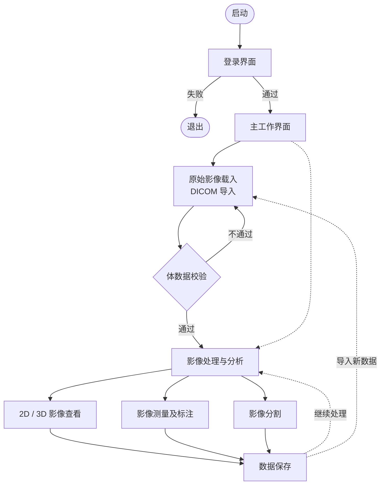

# 医学影像三维重建软件 — 主要业务流程图

> 适用于软件注册附录「用户界面关系图 / 业务流程图」。

## 流程图

将下方 Mermaid 源码复制到 [Mermaid Live Editor](https://mermaid.live) 可导出 PNG/SVG；或使用 `mmdc -i 主要业务流程图.mmd -o 主要业务流程图.png` 生成图片。

## 必要注释

1. 用户须先通过登录界面完成身份认证，失败则退出。
2. 进入主工作界面后，通过 DICOM 模块导入原始影像；系统对体数据执行业务校验，不通过则提示并需重新导入。
3. 校验通过后，可在查看、测量、分割等功能间按需切换（图中并列表示，无固定顺序）；三维重建能力已包含在分割及后续模型显示流程中，不再单独列出。
4. 用户可将当前场景及处理结果保存；保存后可继续处理或导入新数据。
