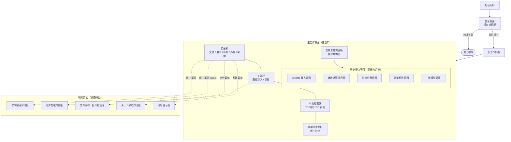

# 医学影像三维重建软件 — 用户界面关系图

> 适用于软件注册附录。描述各界面之间的层级与调用关系（非业务流程）。

## 关系图（SVG）

可直接使用同目录下的 `用户界面关系图.svg` 插入 Word/PDF。

## Mermaid 源码

复制到 [Mermaid Live Editor](https://mermaid.live) 可导出 PNG/SVG。

## 必要注释

1. **登录界面**：软件启动时以模态对话框呈现，验证通过后方可进入主工作界面。
2. **主工作界面**：由菜单栏、工具栏、左侧模块面板、中央 2D/3D 视窗区及底部批注面板组成，为各功能模块的容器。
3. **功能模块界面**：在左侧面板内切换显示，包括 DICOM 导入、体数据、分割、测量标注、三维模型等，与中央视窗联动。
4. **辅助界面**：由主界面菜单栏或工具栏触发，以模态对话框形式弹出，操作完成后返回主工作界面。
