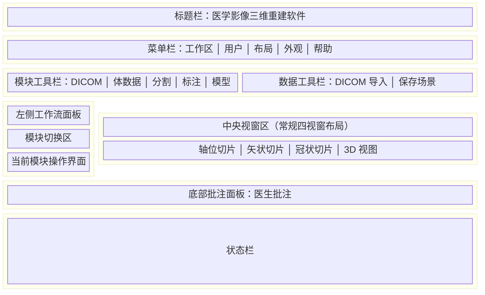

# 医学影像三维重建软件 — 用户界面布局图

> 适用于软件注册附录。以图示方式介绍主工作界面的空间布局与各功能区域，说明界面由哪些模块组成（非界面跳转关系，亦非业务流程）。

## 布局图（SVG）

可直接使用同目录下的 `用户界面布局图.svg` 插入 Word/PDF。

## Mermaid 源码

复制到 [Mermaid Live Editor](https://mermaid.live) 可导出 PNG/SVG。

## 界面区域说明

| 区域 | 位置 | 主要功能 |
|------|------|----------|
| 标题栏 | 窗口顶部 | 显示软件名称，含窗口控制按钮 |
| 菜单栏 | 标题栏下方 | 工作区（文件操作）、用户、布局、外观、帮助 |
| 模块工具栏 | 菜单栏下方左侧 | 快速切换 DICOM / 体数据 / 分割 / 标注 / 模型等功能模块 |
| 数据工具栏 | 菜单栏下方右侧 | DICOM 数据导入、场景保存等常用操作 |
| 左侧工作流面板 | 主区域左侧 | 显示当前选中模块的操作界面，随模块切换更新 |
| 中央视窗区 | 主区域中央 | 2D 切片视图（轴位/矢状/冠状）与 3D 重建视图，随数据与模块联动刷新 |
| 底部批注面板 | 主区域底部 | 医生批注录入与查看 |
| 状态栏 | 窗口最底部 | 显示当前操作状态与提示信息 |

## 功能模块（左侧面板内切换）

1. **DICOM 导入**：医学影像 DICOM 数据浏览与导入。
2. **体数据管理**：导入后体数据的查看、属性调整与管理。
3. **影像分割**：对体数据进行区域分割与编辑。
4. **测量标注**：在影像上添加测量与标注信息。
5. **三维模型**：三维模型生成、显示与管理。

## 启动相关界面（非主窗口布局）

- **启动闪屏**：程序启动时短暂显示的品牌画面。
- **登录界面**：以模态对话框呈现，验证通过后方可进入主工作界面。

## 必要注释

1. 主工作界面采用经典医学影像软件布局：上方菜单与工具栏、左侧模块面板、中央多视窗显示区、底部辅助面板。
2. 功能模块在左侧面板内切换，中央视窗区保持可见并与当前模块联动。
3. 用户、修改密码、用户管理等操作通过菜单栏「用户」菜单以模态对话框形式弹出，不改变主窗口整体布局。
